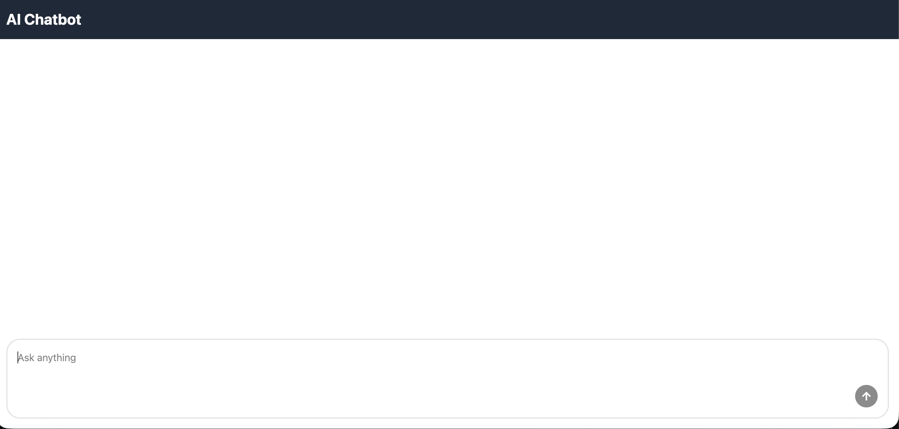
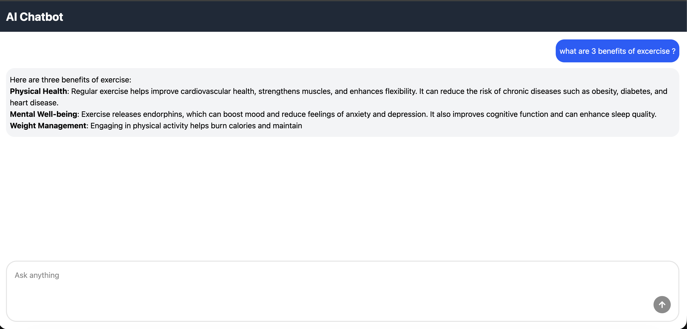

# 🤖 AI Chatbot – Full Stack Project

A simple AI-powered chatbot built using **React**, **TypeScript**, **Express**, and **OpenAI API**.
This project follows a clean architecture with modular backend layers and reusable frontend components.

---

# 🚀 Features

- AI-generated chat responses
- Conversation ID support
- Markdown message rendering
- Typing indicator
- Auto scroll to latest messages
- Input validation & error handling
- Modular code structure

---

# 🧱 Tech Stack

## Frontend

- React with Vite
- TypeScript
- Tailwind CSS
- shadcn/ui
- react-hook-form

## Backend

- Node.js
- Express
- TypeScript
- OpenAI API

---

# 📂 Project Structure

```
server/
  routes/
  controllers/
  services/
  repositories/

client/
  components/
    Chatbot/
    ChatInput/
    ChatMessages/
    TypingIndicator/
```

---

# 🔌 API Endpoint

## POST `/api/chat`

### Request

```
{
  "message": "Hello",
  "conversationId": "optional"
}
```

### Response

```
{
  "reply": "AI response",
  "conversationId": "id"
}
```

---

# ⚙️ Installation

## 1. Clone Repo

```
git clone <your-repo-url>
cd project
```

## 2. Install Dependencies

### Backend

```
cd server
npm install
```

### Frontend

```
cd client
npm install
```

## 3. Environment Variables

Create `.env` file inside server:

```
OPENAI_API_KEY=your_api_key
PORT=5000
```

## 4. Run Project

### Start Backend

```
npm run dev
```

### Start Frontend

```
npm run dev
```

---

# 📸 Screenshots

## Chat UI



## AI Response Example



```

---

# 🔮 Future Improvements

- Streaming responses
- Authentication
- Database chat history
- Deployment setup

---

# 🧑‍💻 Author

Full-stack AI chatbot built with modern architecture and clean code practices.
```
